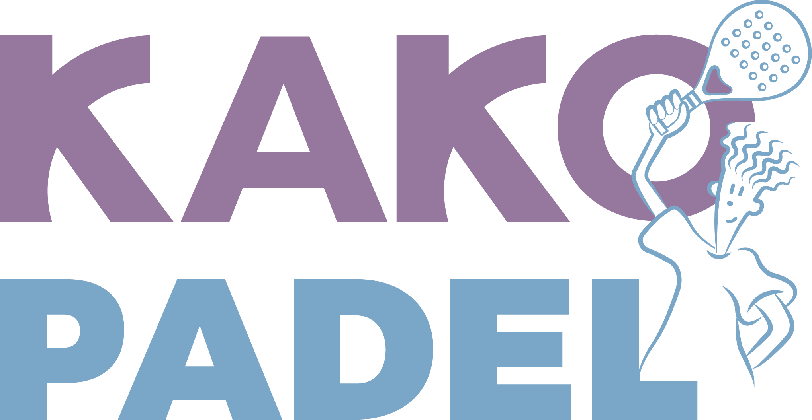

🖥️ Kako Padel - Frontend

Frontend del sistema de reservas para la cancha de pádel Kako Padel.
Este proyecto provee una Single Page Application (SPA) desarrollada en React, que permite a los clientes visualizar los servicios, consultar la disponibilidad de turnos y realizar reservas de manera ágil y sencilla.

📌 Funcionalidades principales
🏠 Página principal

Sección Servicios: tarjetas informativas (cancha blindex exterior, interior, vestuarios, cantina).

Sección Reservas: consulta de turnos disponibles en la semana y botón para reservar.

Sección Contacto: acceso directo a WhatsApp de los dueños y mapa con la ubicación.

🔗 Conexión con Backend

Consumo de la API REST desarrollada en Laravel.

Consulta en tiempo real de turnos disponibles.

Preparado para integración con autenticación y pagos en línea.

🎨 Interfaz

Diseño responsivo adaptado a desktop y mobile.

Header fijo con navegación entre secciones.

Estilo simple, moderno y fácil de usar.

🛠️ Tecnologías utilizadas

React 18 – framework principal.

Vite – bundler y servidor de desarrollo.

Axios – cliente HTTP para comunicación con backend.

CSS3 – estilos personalizados.

React Router – navegación (planificado para futuras rutas).

📬 Contacto

Desarrollado por Lorenzetti Lucio
E-mail: lucioadriell@gmail.com